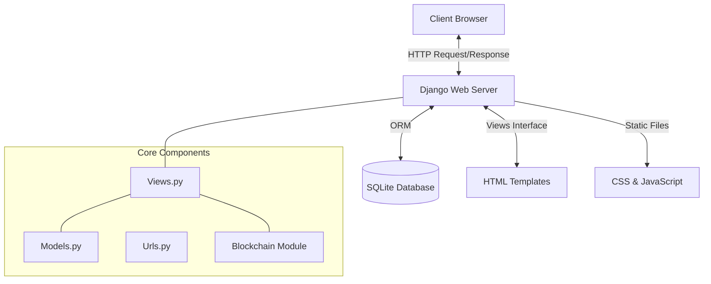

# System Architecture

## High-Level Overview

The KofC project follows the **Model-View-Template (MVT)** architectural pattern standard in Django apps.

## Django Application Structure

- **`base/`**: The root configuration folder.
  - `urls.py`: Main URL routing.
  - `settings.py`: Global configuration (apps, middleware, db).
- **`capstone_project/`**: The main application logic.
  - `models.py`: Database schemas and Blockchain logic.
  - `views.py`: Request handlers and business logic.
  - `urls.py`: App-specific URL routing.
  - `admin.py`: Django Admin configuration.
  - `apps.py`: App configuration.
  - `utils.py`: Helper functions.
  - **`templates/`**: HTML files (Dashboard, Auth, Landing pages).
  - **`static/`**: CSS, JS, Images.

## Key Modules

### Blockchain Logic (`models.py`)
The blockchain is implemented directly within `models.py` for persistence.
- **`Block` Class**: Represents a single block containing `index`, `timestamp`, `transactions`, `proof`, `previous_hash`, and `hash`.
- **`Blockchain` Class**: Manages the chain, validation (`is_chain_valid`), and proof-of-work (`proof_of_work`).
- **Data Flow**: Donation -> Pending Transaction -> block creation (mining) -> Unmutable Ledger.

### Authentication (`views.py`)
- Custom `User` model extends `AbstractUser`.
- Role-based redirection upon login (Admin -> Admin Dashboard, Officer -> Officer Dashboard, Member -> Member Dashboard).

### Analytics Engine
- Aggregates data from `Event`, `Donation`, and `User` models.
- Served via `analytics_view` and visualized using **Chart.js**.
