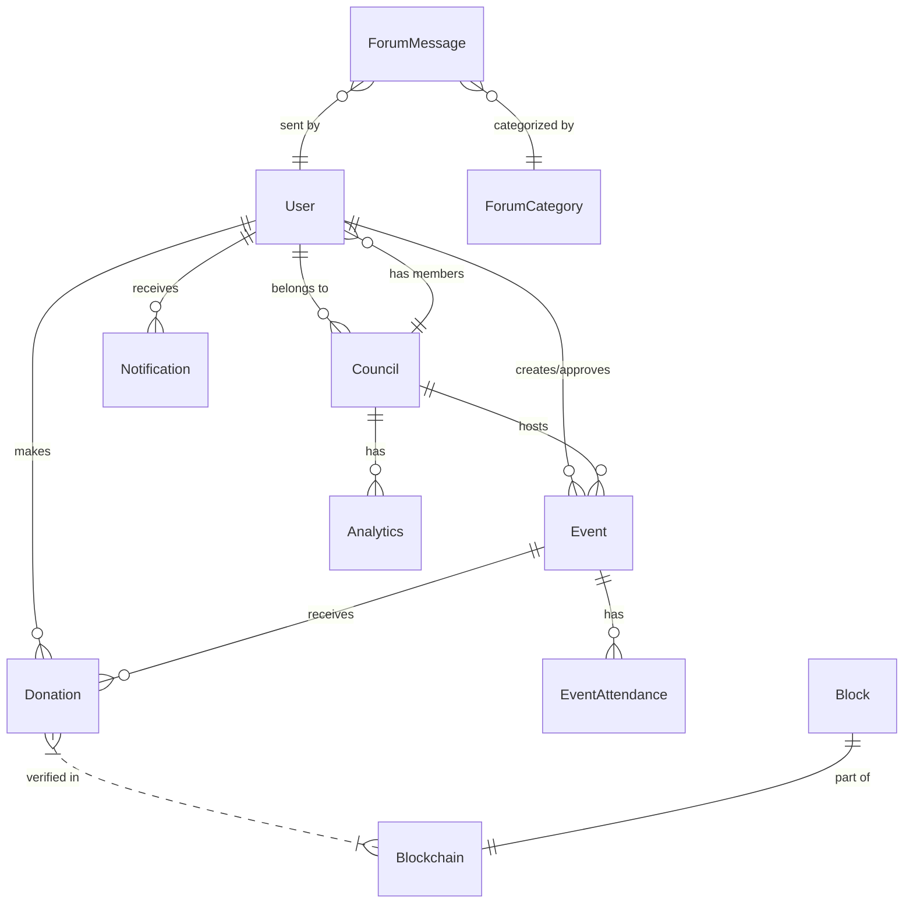

# Database Schema

## Entity Relationship Diagram

## Detailed Models

### 1. `User` (Custom User Model)
Extends `AbstractUser`. Main entity for all system actors.

| Field | Type | Description |
|-------|------|-------------|
| `role` | CharField | `admin`, `officer`, `member`, `pending` |
| `current_degree` | CharField | 1st, 2nd, 3rd, 4th Degree |
| `council` | ForeignKey | Link to `Council` |
| `profile_picture` | ImageField | User avatar |
| `e_signature` | ImageField | For signing documents/forms |
| `recruiter_name` | CharField | Name of person who recruited this user |

### 2. `Council`
Represents a KofC Council (local branch).

| Field | Type | Description |
|-------|------|-------------|
| `name` | CharField | Council Name |
| `district` | CharField | District number/name |
| `location_*` | CharField | Address fields (city, province, etc.) |

### 3. `Event`
Events managed by the council.

| Field | Type | Description |
|-------|------|-------------|
| `status` | CharField | `pending`, `approved`, `rejected` |
| `date_from` | DateField | Start date |
| `raised_amount` | Decimal | Funds raised during/for event |
| `created_by` | ForeignKey | User who proposed the event |

### 4. `Donation`
Financial contributions.

| Field | Type | Description |
|-------|------|-------------|
| `transaction_id` | CharField | Unique GCASH-xxxx ID |
| `amount` | Decimal | Donation value |
| `payment_method` | CharField | `gcash`, `manual` |
| `signature` | TextField | Cryptographic signature for blockchain verification |

### 5. `Block` (Blockchain)
Represents a block in the ledger.

| Field | Type | Description |
|-------|------|-------------|
| `index` | Integer | Position in chain |
| `transactions` | JSONField | List of donation data |
| `hash` | CharField | SHA-256 hash of current block |
| `previous_hash` | CharField | Hash of previous block |
| `proof` | BigInteger | Proof of Work nonce |

### 6. `Notification`
System alerts for users.

| Field | Type | Description |
|-------|------|-------------|
| `notification_type` | CharField | e.g., `donation_received`, `event_today` |
| `is_read` | Boolean | Read status |
| `related_user/event` | ForeignKey | generic relations for context |
